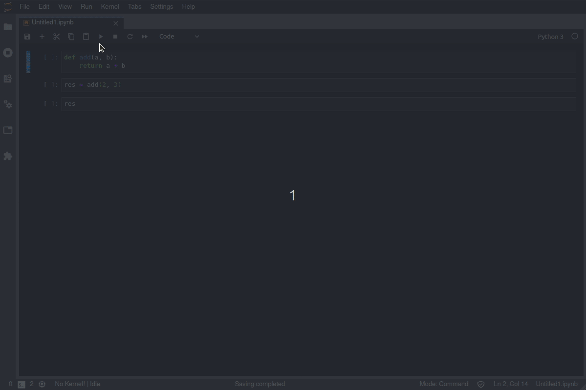

# jupyterlab-cell-flash


[](https://mybinder.org/v2/gh/jtpio/jupyterlab-cell-flash/master?urlpath=/lab/tree/demo.ipynb)
[](https://www.npmjs.com/package/jupyterlab-cell-flash)

Show a flash effect when a notebook cell is executed.



## Requirements

- JupyterLab >= 2.0

## Install

```bash
jupyter labextension install jupyterlab-cell-flash
```

## Settings

Use the following settings to tweak the color and the duration of the animation (in `Settings > Advanced Settings Editor`):

```json5
{
  // The base color for the flash effect
  "color": "rgba(255, 255, 0, 0.5)",

  // The duration of the flash effect animation (in seconds)
  "duration": 0.5
}
```


## Contributing

### Install

The `jlpm` command is JupyterLab's pinned version of
[yarn](https://yarnpkg.com/) that is installed with JupyterLab. You may use
`yarn` or `npm` in lieu of `jlpm` below.

```bash
# Clone the repo to your local environment
# Move to jupyterlab-cell-flash directory

# Install dependencies
jlpm
# Build Typescript source
jlpm build
# Link your development version of the extension with JupyterLab
jupyter labextension link .
# Rebuild Typescript source after making changes
jlpm build
# Rebuild JupyterLab after making any changes
jupyter lab build
```

You can watch the source directory and run JupyterLab in watch mode to watch for changes in the extension's source and automatically rebuild the extension and application.

```bash
# Watch the source directory in another terminal tab
jlpm watch
# Run jupyterlab in watch mode in one terminal tab
jupyter lab --watch
```

### Uninstall

```bash
jupyter labextension uninstall jupyterlab-cell-flash
```
